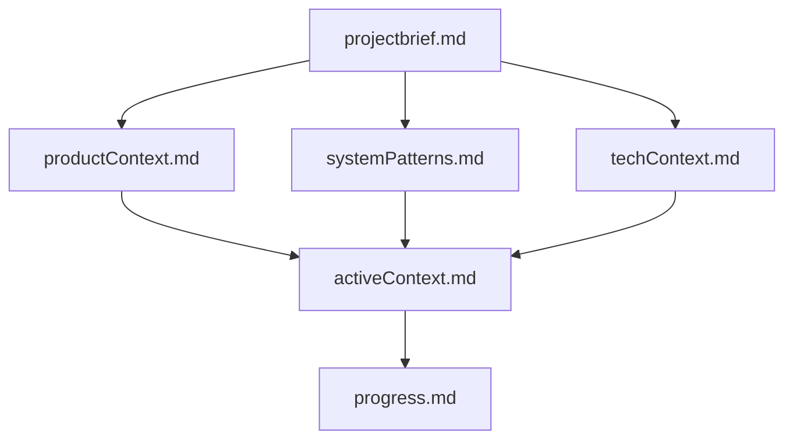

# CLAUDE.md

This file provides guidance to Claude Code (claude.ai/code) when working with code in this repository.

## Project Overview

Cypher Arena is a platform for freestyle rap battles, designed to provide various practice modes (Word, Image, Contrasting, Topic) and battle organization tools. It serves as a centralized platform for both practice and competitive freestyle activities.

## Architecture

### Frontend
- React Native for Web + React.js
- State management using Zustand
- Components structured around battle visualization modes
- IndexedDB for image caching

### Backend
- Django/Django REST Framework
- SQLite database (with potential for PostgreSQL migration)
- Celery for asynchronous tasks
- Core functionality split across modules (words, images_mode, user_management)


## Development Environment Setup

### Backend Setup
```bash
# Navigate to backend directory
cd backend

# Create and activate virtual environment (if not already done)
python -m venv venv
source venv/bin/activate  # Linux/Mac
# or
venv\Scripts\activate  # Windows

# Install dependencies
pip install -r requirements.txt

# Run migrations
python manage.py migrate

# Run development server
python manage.py runserver
```

### Frontend Setup
```bash
# Navigate to frontend directory
cd frontend

# Install dependencies
npm install

# Start development server
npm start
```

## Common Development Commands

### Backend Commands
```bash
# Run Django server
cd backend
python manage.py runserver

# Create migrations
python manage.py makemigrations

# Apply migrations
python manage.py migrate

# Create superuser
python manage.py createsuperuser

# Run backend tests
python manage.py test

# Start Celery worker
celery -A core worker -l info

# Start Celery beat scheduler
celery -A core beat -l info
```

### Frontend Commands
```bash
# Start development server
cd frontend
npm start

# Build for production
npm run build

# Run tests
npm test

# Run tests in watch mode
npm run test:watch
```

### Deployment and Server Management
```bash
# Restart services using the server control script
./restart_server.sh backend     # Restart only the backend
./restart_server.sh frontend    # Restart only the frontend
./restart_server.sh celery      # Restart celery services
./restart_server.sh all         # Restart all services
./restart_server.sh status      # Show the status of all screen sessions
```

## Key Files and Directories

### Backend
- `backend/core/` - Core Django settings and configuration
- `backend/words/` - Word mode implementation
- `backend/images_mode/` - Image mode implementation
- `backend/user_management/` - User authentication and management

### Frontend
- `frontend/src/` - Main source code
- `frontend/src/App.js` - Main application component
- Battle mode components (based on documentation):
  - `BaseBattleVisualizer.js` - Core visualization component
  - `TimerControls.js` - Timer UI controls
  - `useTimerControl.js` - Timer logic hook
  - `timerStore.js` - Zustand store for timer state
  - Mode-specific components (WordMode, ImagesMode, ContrastingMode, TopicMode)

## Configuration

The project uses a configuration file (`config.json`) for deployment settings. This file is used by the `restart_server.sh` script to manage services.

## Development Guidelines

1. Follow the existing component structure for new battle modes
2. Use the Zustand store pattern for state management
3. For image-heavy features, leverage the IndexedDB caching system
4. Backend features should follow the Django REST Framework patterns


## Memory Bank Structure

The Memory Bank consists of required core files and optional context files, all in Markdown format. Files build upon each other in a clear hierarchy:



### Core Files (Required)
1. `projectbrief.md`
   - Foundation document that shapes all other files
   - Created at project start if it doesn't exist
   - Defines core requirements and goals
   - Source of truth for project scope

2. `productContext.md`
   - Why this project exists
   - Problems it solves
   - How it should work
   - User experience goals

3. `activeContext.md`
   - Current work focus
   - Recent changes
   - Next steps
   - Active decisions and considerations

4. `systemPatterns.md`
   - System architecture
   - Key technical decisions
   - Design patterns in use
   - Component relationships

5. `techContext.md`
   - Technologies used
   - Development setup
   - Technical constraints
   - Dependencies

6. `progress.md`
   - What works
   - What's left to build
   - Current status
   - Known issues

### Additional Context
Create additional files/folders within memory-bank/ when they help organize:
- Complex feature documentation
- Integration specifications
- API documentation
- Testing strategies
- Deployment procedures