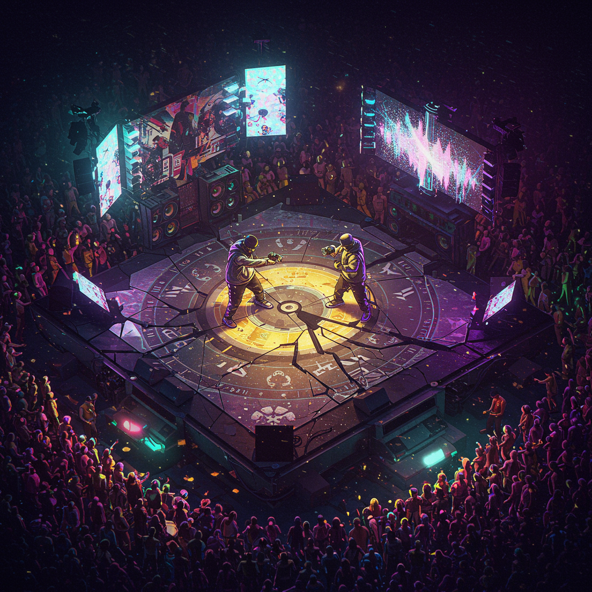

# Cypher Arena

## Aim

The aim of this project is to revolutionize Polish freestyle rap battles, drawing inspiration from the Spanish Latin scene with focus on reducing vulgarity and promoting the style and culture of the art of words. Cypher Arena addresses the gap in existing tools by providing a centralized platform for both fun and competitive freestyle activities. The goal is to be a tool for players, judges, organizers, and also a source of viral content.

## Current state

Cypher Arena is live at https://cypher-arena.com/. Currently, there is word mode, image mode, contrastive mode, and topic mode with customizable timer settings. The frontend and backend work under one gunicorn process.

**About word mode**: There is a large (~200,000) database of Polish words, which are then grouped by occurrence and linguistic type.
**About image mode**: There is a large open-source image library, which is used. There are >2000 unique categories of images, to supply maximum diversity of topics, in about 7GB of data on the production server.
**About contrastive mode**: This mode provides AI-generated pairs for contrasting freestyle.
**About topic mode**: This mode provides more than 60000 topics generated in an agentic RAG process.

## Logo

The Cypher Arena logo represents the dynamic and competitive nature of freestyle rap battles. It symbolizes the energy, creativity, and artistry involved in the art of words.

## Core Features

*   Basic Battle System: Timer functionality, second window support, basic round management, and content display.
*   Practice Modes: Topic mode, word mode, image mode, and contrasting mode (with user ratings for AI-generated pairs).

## Goals

### Main Goals

### Introduction of New Round Types

*   **Beat Mode**: Integrating streaming services like Spotify/Soundcloud for instrumentals
*   **Hard Mode / Soft Mode**: A new random word introduced with time intervals
*   **Kick Back**: A new format one says line and second has to say 3 next lines on the same rhyme
*   **Character Fights**: Thematic battles like Superman vs Batman.

### Utilizing Scene Strengths

*   **Image Displays**: Create a community-contributed image base and develop a method to scrape images from platforms like X.
*   **GIF Displays**: Incorporating animated GIFs into performances.
*   **Classic Topics**: Maintaining the traditional elements of Polish freestyle.

## Functional Goals

*   **Judging system**: Adapted to polish conditions system of judging freestyle, taken from the FMS Series in Spanish/ Latin world.
*   **Tool for Organizing Freestyle Battles**: This includes creating tournaments and managing the judging of the elimination stage.

## Technical Specifications

*   **Frontend**: React Native for Web, targeting both web and potential mobile platforms. Key components include App, BaseBattleVisualizer, and TimerControls. State management is handled using Zustand.
*   **Backend**: Django REST framework with SQLite as the initial database. Future upgrades may include PostgreSQL.
*   **Deployment**: Cloudflare Tunnel with Nginx on Linux (Ubuntu Server).

## Current Work Focus

*   Finalizing server migration and deploying the live application.
*   Brainstorming configuration for judging mode.
*   Researching and implementing authentication via Google, Facebook, and Apple.
*   Developing beat playback integration (e.g., Spotify/YouTube/SoundCloud).

---

*This project is a community-driven initiative aimed at enriching the Polish freestyle rap scene by blending traditional elements with innovative approaches.*
